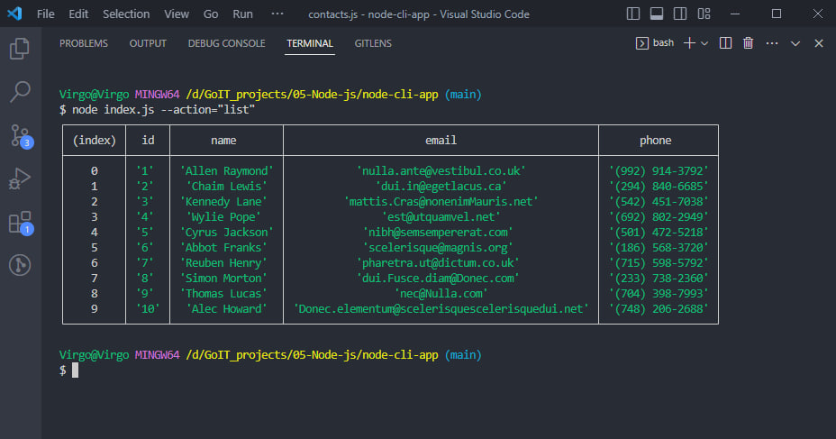
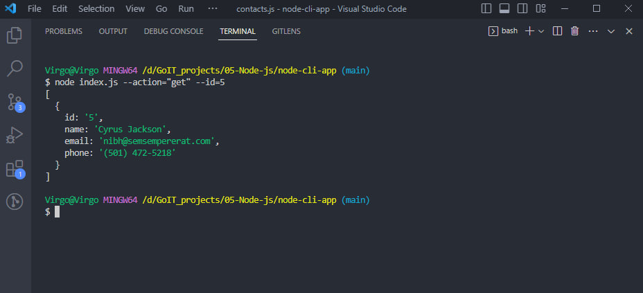
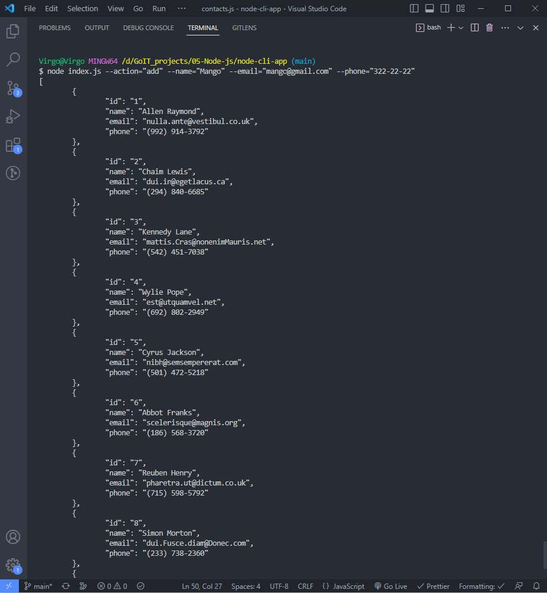
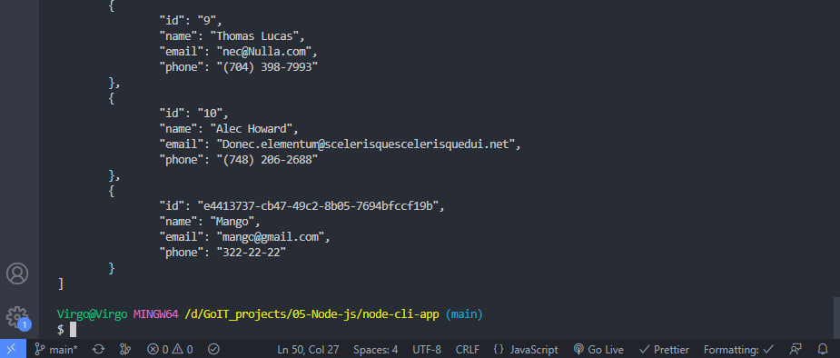
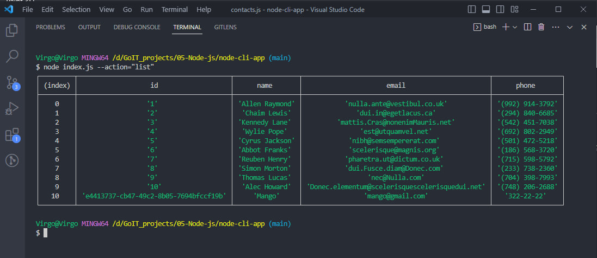
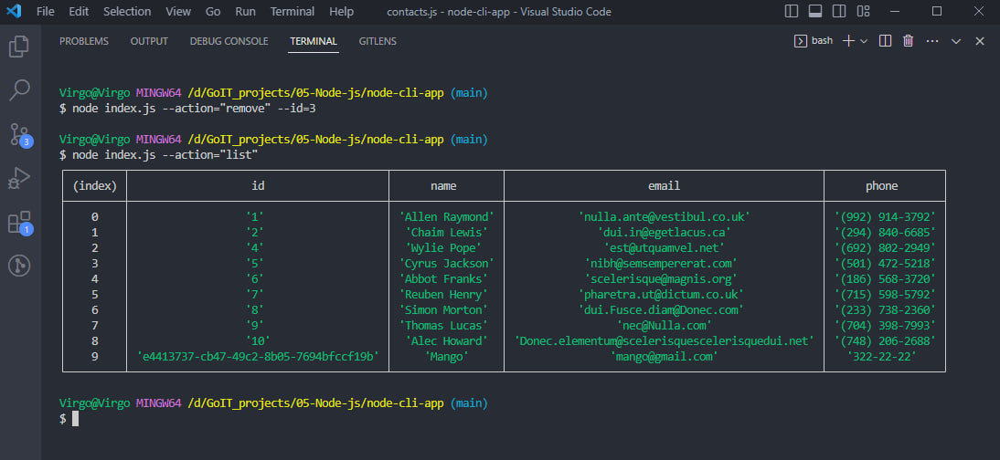

# CLI application

## Get and display the entire list of contacts in the form of a table (console.table)

node index.js --action="list"

## Get contact by id

node index.js --action="get" --id=5

## Add the contact

node index.js --action="add" --name="Mango" --email="mango@gmail.com" --phone="322-22-22"

  

## Delete the contact

node index.js --action="remove" --id=3

